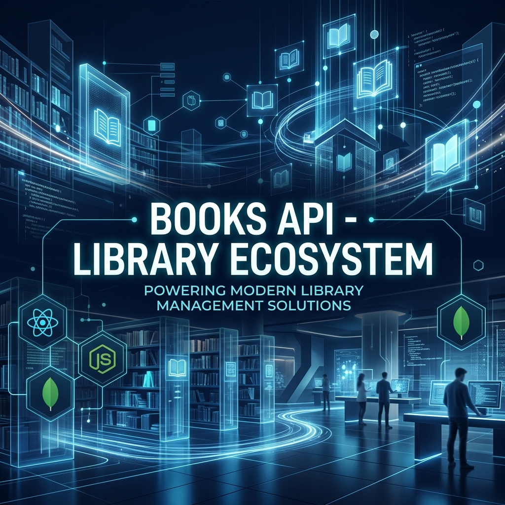
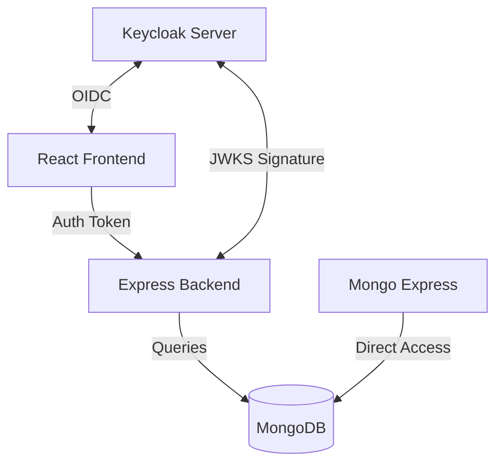
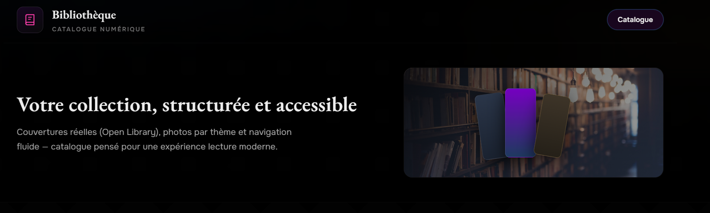
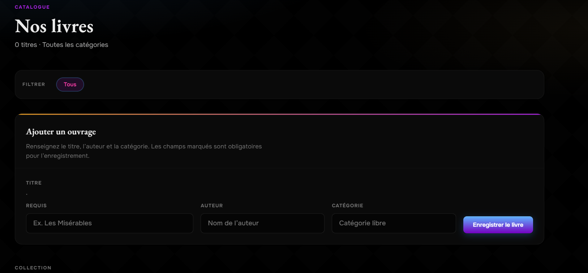

<div align="center">
  

  <h1>📚 Books API — Library Ecosystem</h1>
  <p><strong>A sleek, modern, and premium full-stack book catalog built for the future of digital libraries.</strong></p>

  <p>
    
    
    
    
    
    
    
  </p>

  <h4>
    <a href="#-features">Features</a> ●
    <a href="#-architecture">Architecture</a> ●
    <a href="#-installation">Installation</a> ●
    <a href="#-deployment">Deployment</a>
  </h4>
</div>

---

## 🌟 Overview

Welcome to the **Books API Library**, a robust educational ecosystem designed to demonstrate modern full-stack development best practices. From a stunningly responsive React frontend to a secure Express/Mongoose backend, this project is a complete solution for managing book catalogs with enterprise-level security.

> [!TIP]
> This project isn't just a simple CRUD; it integrates **Keycloak (OIDC/RBAC)** for professional-grade identity management.

---

## ✨ Features

- **🎨 Premium UI/UX**: A beautiful interface featuring "Book Spines" and dynamic covers fetched from the OpenLibrary API.
- **🔐 Enterprise Security**: Integrated with Keycloak for OpenID Connect (OIDC) and Role-Based Access Control (RBAC).
- **📚 Smart Catalog**: Automatic cover detection, category badging, and detailed book information tracking.
- **🛠️ Admin Dashboard**: Dedicated database administration via Mongo Express.
- **⚡ Performance First**: Built with **Vite** for near-instant development and optimized production builds.
- **☁️ Cloud Ready**: Optimized for Vercel deployment with serverless backend support.

---

## 🏗️ Architecture

The ecosystem is split into three core modules:

| Module       | Stack              | Role                          | Port   |
| :----------- | :----------------- | :---------------------------- | :----- |
| **Frontend** | React + Vite       | Modern UI, Keycloak Provider  | `5173` |
| **Backend**  | Express + Mongoose | REST API, Security Middleware | `3000` |
| **Admin UI** | Mongo Express      | DB Management & Visualization | `8081` |



---

## ⚙️ Tech Stack

### Frontend

- **Framework**: React 18
- **Build Tool**: Vite
- **Styling**: Modern CSS (Flexbox/Grid)
- **Auth**: Keycloak JS Adapter

### Backend

- **Runtime**: Node.js
- **Framework**: Express.js
- **Database**: MongoDB (Atlas/Local)
- **Security**: JWT Validation (Jose), RBAC Middlewares

---

## 🚀 Installation & Setup

### Prerequisites

- **Node.js** (v16.x or higher)
- **MongoDB** running locally on port `27017`
- **Keycloak** (if running locally, configured with `bookstore-realm`)

### Step-by-Step

1. **Clone the repository**

   ```bash
   git clone https://github.com/your-username/books-api.git
   cd books-api
   ```

2. **Initialize the Database** (Optional Seed)

   ```bash
   cd mongo-express-app
   npm install
   npm run seed
   ```

3. **Start the Backend**

   ```bash
   cd ../backend
   npm install
   npm run dev
   ```

4. **Launch the Frontend**
   ```bash
   cd ../frontend/atelier
   npm install
   npm run dev
   ```

---

## 🔐 Keycloak Configuration

To achieve the RBAC functionality (Admin vs User), ensure your Keycloak server is configured as follows:

1. Create a Realm: `bookstore-realm`.
2. Create a Client: `bookstore-client`.
   - **Access Type**: Public/Confidential.
   - **Valid Redirect URIs**: `http://localhost:5173/*`.
   - **Web Origins**: `http://localhost:5173`.
3. Define Roles: `ADMIN`, `CLIENT`.
4. Define Group: `clients` with default role `CLIENT`.

See [Livrables/Rapport_Keycloak.md](./Livrables/Rapport_Keycloak.md) for detailed setup steps.

---

## ☁️ Deployment

This project is tailored for **Vercel** monorepo setups.

1. Connect your GitHub repository to Vercel.
2. Set Environment Variables:
   - `MONGODB_URI`: Your MongoDB Atlas connection string.
3. Vercel will automatically detect the `vercel.json` configuration for root deployment.

For more details, check [docs/VERCEL.md](./docs/VERCEL.md).

---

## 📸 Screenshots

<p align="center">
  <i>Preview of the beautiful Library UI</i>
  <br />
  
  <br />
  
</p>

---

## 📜 License

Created for educational purposes as a demonstration project. Feel free to use and adapt!

---

<div align="center">
  Made with ❤️ by TF154
</div>
